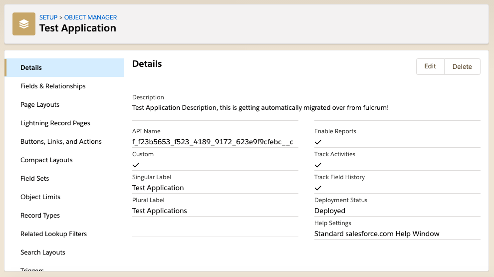

# FulcrumToSalesforce
Provides classes and various intake methods for Salesforce to consume Fulcrum data.

## Dependencies
https://github.com/damienheiser/python-SalesforceMetadataAPISupport

I have expanded https://github.com/sun30nil/python-SalesforceMetadataAPISupport to accept the createMetadata() and updateMetadata() methods for the Salesforce Metadata API

```pip install klein```

## Proof of Concept FulcrumWebhookIntakeServer.py
This initial proof of concept intakes requests from the Fulcrum Webhook form.create and form.update, and then Creates the associated Object and Fieles in Salesforce.  Congrats, we have one-way Model integration 

```python ./FulcrumWebhookIntakeServer.py 
2019-04-14 08:06:26-0700 [-] Log opened.
2019-04-14 08:06:26-0700 [-] Site starting on 8080
2019-04-14 08:06:26-0700 [-] Starting factory <twisted.web.server.Site instance at 0x10568e5f0>
2019-04-14 08:06:31-0700 [-] 
2019-04-14 08:06:31-0700 [-] "35.172.214.156" - - [14/Apr/2019:15:06:31 +0000] "POST /fulcrumApp/webHook/Receipt HTTP/1.1" 200 - "-" "Ruby"
2019-04-14 08:06:52-0700 [-] 
2019-04-14 08:06:52-0700 [-] Form Update
2019-04-14 08:06:52-0700 [-] 
2019-04-14 08:06:52-0700 [-] Logged In successfully!
2019-04-14 08:06:52-0700 [-] 
2019-04-14 08:06:52-0700 [-] Creating Object! Test Application
2019-04-14 08:06:52-0700 [-]    Creating Field! f_Fulcrum_Id__c : Fulcrum Id (Text)
2019-04-14 08:06:52-0700 [-]    Creating Field! f_Location__c : Location (Location)
2019-04-14 08:06:52-0700 [-]    Creating Field! f_Assigned_To__c : Assigned To (Text)
2019-04-14 08:06:52-0700 [-]    Creating Field! f_Fulcrum_Assigned_To_Id__c : Fulcrum Assigned To Id (Text)
2019-04-14 08:06:52-0700 [-]    Creating Field! f_Fulcrum_Project_Id__c : Fulcrum Project Id (Text)
2019-04-14 08:06:52-0700 [-]    Creating Field! f_Fulcrum_Project__c : Fulcrum Project (Lookup)
2019-04-14 08:06:52-0700 [-]    Creating Field! f_Title__c : Title (Text)
2019-04-14 08:06:52-0700 [-]    Creating Field! f_created_duration__c : Created Duration (Number Precision:18 Scale:0)
2019-04-14 08:06:52-0700 [-]    Creating Field! f_updated_duration__c : Updated Duration (Number Precision:18 Scale:0)
2019-04-14 08:06:52-0700 [-]    Creating Field! f_edited_duration__c : Edited Duration (Number Precision:18 Scale:0)
2019-04-14 08:06:52-0700 [-]    Creating Field Value! status : Status (StatusField) | Value : Status 1
2019-04-14 08:06:52-0700 [-]    Creating Field Value! status : Status (StatusField) | Value : Status 2
2019-04-14 08:06:52-0700 [-]    Creating Field Value! status : Status (StatusField) | Value : Status 3
2019-04-14 08:06:52-0700 [-]    Creating Field! f_status__c : Status (Picklist)
2019-04-14 08:06:52-0700 [-]    Creating Field! f_7a8c__c : Text Label (Text)
2019-04-14 08:06:52-0700 [-]    Creating Field! f_d823__c : Number Label (Number Precision:18 Scale:9)
2019-04-14 08:06:52-0700 [-]    Creating Field! f_7a17__c : Yes No Label (Picklist)
2019-04-14 08:06:52-0700 [-]    Creating Field! f_92a0__c : Date Label (Date)
2019-04-14 08:06:52-0700 [-]    Creating Field! f_92a0_62e5__c : Time Label (DateTime)
2019-04-14 08:06:52-0700 [-]    Creating Field! f_b373__c : Single Choice Label (Picklist)
2019-04-14 08:06:52-0700 [-]    Creating Field! f_bf37__c : Multiple Choice Label (MultiselectPicklist)
2019-04-14 08:06:52-0700 [-]    Creating Field! f_8361__c : Repeatable Section (LongTextArea)
2019-04-14 08:06:52-0700 [-]    Creating Field! f_1fce__c : Signature (LongTextArea)
2019-04-14 08:06:52-0700 [-]    Creating Field! f_6142__c : Photos (LongTextArea)
2019-04-14 08:06:52-0700 [-]    Creating Field! f_9744__c : Videos (LongTextArea)
2019-04-14 08:06:52-0700 [-]    Creating Field! f_a4d1__c : Audio (LongTextArea)
2019-04-14 08:06:52-0700 [-]    Creating Multiple Fields! Address (Address)
2019-04-14 08:06:52-0700 [-]    Creating Field! f_3998_sub_thoroughfare__c : Address Street Number (Text)
2019-04-14 08:06:52-0700 [-]    Creating Field! f_3998_thoroughfare__c : Address Street (Text)
2019-04-14 08:06:52-0700 [-]    Creating Field! f_3998_suite__c : Address Suite (Text)
2019-04-14 08:06:52-0700 [-]    Creating Field! f_3998_locality__c : Address City (Text)
2019-04-14 08:06:52-0700 [-]    Creating Field! f_3998_sub_admin_area__c : Address County (Text)
2019-04-14 08:06:52-0700 [-]    Creating Field! f_3998_admin_area__c : Address State/Province (Text)
2019-04-14 08:06:52-0700 [-]    Creating Field! f_3998_country__c : Address Country (Text)
2019-04-14 08:06:52-0700 [-]    Creating Field! f_7284__c : Barcode (Text)
2019-04-14 08:06:52-0700 [-]    Creating Field! f_e73f__c : Hyperlink (Url)
2019-04-14 08:06:52-0700 [-]    Creating Field! f_631e__c : Record Link (Lookup)
2019-04-14 08:06:53-0700 [-] 
2019-04-14 08:06:53-0700 [-] Creating Metadata!
```

### Screenshots





## Class: FulcrumApplicationToSalesforceObject
This class provides methods to map Fulcrum Field Types to Salesforce Custom Field Types, extract choice values into Value Sets, create Lookups, create Master Detail relationships, generate DateTime from a Date field immediately preceeding a Time field, generate Address Fields, Decimal Number and Integer Number fields.

### Known limitations
	Does not map ClassificationField
	Does not map CalculationField

### Primary Method construct_fulcrum_sfdc_object (application, action='create')
This method expects the root of an application dict. These are presented different based on the context of data receipt from Fulcrum.

	Webhooks encapsulate in .data

	forms/{{id}}.json encapsulates in .form

	forms.json encapsulates as .forms

#### Action attribute
Use `create` to create new object and field metadata

Use `update` to update currently existing object and field metadata

#### Theory of Operation
	Involk construct_fulcrum_sfdc_object
	Generate Custom Object Dict
	Iterate Through Fields
		Generate Custom Field Dict
	Generate XML
	Inject XML into Salesforce Metadata SOAP API
	Interate Through Fields, Detect Master Detail Relationships
		Generate Custom Object For Each Detail Object
		Generate Custom Field Dict for Each Detail Object
		Generate XML
		Inject XML into Salesforce Metadata SOAP API

### Example Code
In this example, we get a list of every Fulcrum Application. We then iterate through the entire application set, and create an object for every Application and Repeatable Section.

It iterates through create twice, because any Lookup fields that were not active prior to the creation of the object will then be created.

An Update then takes place, so if this code is run after the fact, it will create new objects, and update metadata on previously create objects.

#### Create Salesforce Objects From Every Fulcrum Application
```Python
import json
import FulcrumApplicationToSalesforceObject as fts
import requests

_sfdcPrefix = 'f_'
_sfdcUsername = "your.salesforce@username.com"
_sfdcPassword = "yourSalesforcePassword"
_sfdcToken = "yourSalesforceSecurityToken"
_sfdcSandbox = True
_fulcrumXApiToken = "yourFulcrumAPIToken"

### Don't change anything below this point
_fulcrumBaseURL = 'https://api.fulcrumapp.com/api/v2/'

fulcrumToSalesforce = fts.FulcrumApplicationToSalesforceObject ()

# Get All Fulcrum Applications
url = _fulcrumBaseURL + 'forms.json'
headers = {'X-ApiToken': _fulcrumXApiToken}
r = requests.get(url, headers=headers)
fulcrumForm = r.json()

# Create new objects for each application
for application in fulcrumForm['forms']:
	fulcrumToSalesforce.construct_fulcrum_sfdc_object (application, 'create')

# Run through a second time to allow new Lookup relationships to be discovered
for application in fulcrumForm['forms']:
	fulcrumToSalesforce.construct_fulcrum_sfdc_object (application, 'create')

# Make one more complete pass through in order to make any metadata changes that may have gone through since initial load
for application in fulcrumForm['forms']:
	fulcrumToSalesforce.construct_fulcrum_sfdc_object (application, 'update')
```

#### Create Individual Object (And Detail Objects) From Individiual Fulcrum Application
```Python
import json
import FulcrumApplicationToSalesforceObject as fts
from fulcrum import Fulcrum

_sfdcPrefix = 'f_'
_sfdcUsername = "your.salesforce@username.com"
_sfdcPassword = "yourSalesforcePassword"
_sfdcToken = "yourSalesforceSecurityToken"
_sfdcSandbox = True
_fulcrumXApiToken = "yourFulcrumAPIToken"
#The specific Fulcrum Application Form you would like to create in salesforce
_fulcrumFormId = ""

fulcrum = Fulcrum(key=_fulcrumXApiToken)
fulcrumToSalesforce = fts.FulcrumApplicationToSalesforceObject ()

# Get Individual Fulcrum Form Fulcrum Applications
fulcrumForm = fulcrum.form.find(_fulcrumFormId)

# Create Salesforce Object From Fulcrum Form
fulcrumToSalesforce.construct_fulcrum_sfdc_object (fulcrumForm, 'create')
```

#### Sample Output
```python createSalesforceObject.py 

Logged In successfully!

Creating Object! Test Application
   Creating Field! f_Fulcrum_Id__c : Fulcrum Id (Text)
   Creating Field! f_Location__c : Location (Location)
   Creating Field! f_Assigned_To__c : Assigned To (Text)
   Creating Field! f_Fulcrum_Assigned_To_Id__c : Fulcrum Assigned To Id (Text)
   Creating Field! f_Fulcrum_Project_Id__c : Fulcrum Project Id (Text)
   Creating Field! f_Fulcrum_Project__c : Fulcrum Project (Lookup)
   Creating Field! f_Title__c : Title (Text)
   Creating Field! f_created_duration__c : Created Duration (Number Precision:18 Scale:0)
   Creating Field! f_updated_duration__c : Updated Duration (Number Precision:18 Scale:0)
   Creating Field! f_edited_duration__c : Edited Duration (Number Precision:18 Scale:0)
   Creating Field Value! status : Status (StatusField) | Value : Status 1
   Creating Field Value! status : Status (StatusField) | Value : Status 2
   Creating Field Value! status : Status (StatusField) | Value : Status 3
   Creating Field! f_status__c : Status (Picklist)
   Creating Field! f_7a8c__c : Text Label (Text)
   Creating Field! f_d823__c : Number Label (Number Precision:18 Scale:9)
   Creating Field! f_7a17__c : Yes No Label (Picklist)
   Creating Field! f_92a0__c : Date Label (Date)
   Creating Field! f_92a0_62e5__c : Time Label (DateTime)
   Creating Field! f_b373__c : Single Choice Label (Picklist)
   Creating Field! f_bf37__c : Multiple Choice Label (MultiselectPicklist)
   Creating Field! f_8361__c : Test Repeatable Section (LongTextArea)
   Creating Field! f_1fce__c : Signature (LongTextArea)
   Creating Field! f_6142__c : Photos (LongTextArea)
   Creating Field! f_9744__c : Videos (LongTextArea)
   Creating Field! f_a4d1__c : Audio (LongTextArea)
   Creating Multiple Fields! Address (Address)
   Creating Field! f_3998_sub_thoroughfare__c : Address Street Number (Text)
   Creating Field! f_3998_thoroughfare__c : Address Street (Text)
   Creating Field! f_3998_suite__c : Address Suite (Text)
   Creating Field! f_3998_locality__c : Address City (Text)
   Creating Field! f_3998_sub_admin_area__c : Address County (Text)
   Creating Field! f_3998_admin_area__c : Address State/Province (Text)
   Creating Field! f_3998_country__c : Address Country (Text)
   Creating Field! f_7284__c : Barcode (Text)
   Creating Field! f_e73f__c : Hyperlink (Url)
   Creating Field! f_631e__c : Record Link (Lookup)

Creating Metadata!

<?xml version="1.0" ?>
<root>
	<key name="soapenv:Envelope" type="dict">
		<key name="@xmlns:soapenv" type="str">http://schemas.xmlsoap.org/soap/envelope/</key>
		<key name="@xmlns" type="str">http://soap.sforce.com/2006/04/metadata</key>
		<key name="soapenv:Body" type="dict">
			<createMetadataResponse type="dict">
				<result type="list">
					<item type="dict">
						<fullName type="str">f_f23b5653_f523_4189_9172_623e9f9cfebc__c</fullName>
						<success type="str">true</success>
					</item>
					<item type="dict">
						<fullName type="str">f_f23b5653_f523_4189_9172_623e9f9cfebc__c.f_Fulcrum_Id__c</fullName>
						<success type="str">true</success>
					</item>
					<item type="dict">
						<fullName type="str">f_f23b5653_f523_4189_9172_623e9f9cfebc__c.f_Location__c</fullName>
						<success type="str">true</success>
					</item>
					<item type="dict">
						<fullName type="str">f_f23b5653_f523_4189_9172_623e9f9cfebc__c.f_Assigned_To__c</fullName>
						<success type="str">true</success>
					</item>
					<item type="dict">
						<fullName type="str">f_f23b5653_f523_4189_9172_623e9f9cfebc__c.f_Fulcrum_Assigned_To_Id__c</fullName>
						<success type="str">true</success>
					</item>
					<item type="dict">
						<fullName type="str">f_f23b5653_f523_4189_9172_623e9f9cfebc__c.f_Fulcrum_Project_Id__c</fullName>
						<success type="str">true</success>
					</item>
					<item type="dict">
						<errors type="dict">
							<message type="str">referenceTo value of 'f_Fulcrum_Project__c' does not resolve to a valid sObject type</message>
							<statusCode type="str">FIELD_INTEGRITY_EXCEPTION</statusCode>
						</errors>
						<fullName type="str">f_f23b5653_f523_4189_9172_623e9f9cfebc__c.f_Fulcrum_Project__c</fullName>
						<success type="str">false</success>
					</item>
					<item type="dict">
						<fullName type="str">f_f23b5653_f523_4189_9172_623e9f9cfebc__c.f_Title__c</fullName>
						<success type="str">true</success>
					</item>
					<item type="dict">
						<fullName type="str">f_f23b5653_f523_4189_9172_623e9f9cfebc__c.f_created_duration__c</fullName>
						<success type="str">true</success>
					</item>
					<item type="dict">
						<fullName type="str">f_f23b5653_f523_4189_9172_623e9f9cfebc__c.f_updated_duration__c</fullName>
						<success type="str">true</success>
					</item>
					<item type="dict">
						<fullName type="str">f_f23b5653_f523_4189_9172_623e9f9cfebc__c.f_edited_duration__c</fullName>
						<success type="str">true</success>
					</item>
					<item type="dict">
						<fullName type="str">f_f23b5653_f523_4189_9172_623e9f9cfebc__c.f_status__c</fullName>
						<success type="str">true</success>
					</item>
					<item type="dict">
						<fullName type="str">f_f23b5653_f523_4189_9172_623e9f9cfebc__c.f_7a8c__c</fullName>
						<success type="str">true</success>
					</item>
					<item type="dict">
						<fullName type="str">f_f23b5653_f523_4189_9172_623e9f9cfebc__c.f_d823__c</fullName>
						<success type="str">true</success>
					</item>
					<item type="dict">
						<fullName type="str">f_f23b5653_f523_4189_9172_623e9f9cfebc__c.f_7a17__c</fullName>
						<success type="str">true</success>
					</item>
					<item type="dict">
						<fullName type="str">f_f23b5653_f523_4189_9172_623e9f9cfebc__c.f_92a0__c</fullName>
						<success type="str">true</success>
					</item>
					<item type="dict">
						<fullName type="str">f_f23b5653_f523_4189_9172_623e9f9cfebc__c.f_92a0_62e5__c</fullName>
						<success type="str">true</success>
					</item>
					<item type="dict">
						<fullName type="str">f_f23b5653_f523_4189_9172_623e9f9cfebc__c.f_b373__c</fullName>
						<success type="str">true</success>
					</item>
					<item type="dict">
						<fullName type="str">f_f23b5653_f523_4189_9172_623e9f9cfebc__c.f_bf37__c</fullName>
						<success type="str">true</success>
					</item>
					<item type="dict">
						<fullName type="str">f_f23b5653_f523_4189_9172_623e9f9cfebc__c.f_8361__c</fullName>
						<success type="str">true</success>
					</item>
					<item type="dict">
						<fullName type="str">f_f23b5653_f523_4189_9172_623e9f9cfebc__c.f_1fce__c</fullName>
						<success type="str">true</success>
					</item>
					<item type="dict">
						<fullName type="str">f_f23b5653_f523_4189_9172_623e9f9cfebc__c.f_6142__c</fullName>
						<success type="str">true</success>
					</item>
					<item type="dict">
						<fullName type="str">f_f23b5653_f523_4189_9172_623e9f9cfebc__c.f_9744__c</fullName>
						<success type="str">true</success>
					</item>
					<item type="dict">
						<fullName type="str">f_f23b5653_f523_4189_9172_623e9f9cfebc__c.f_a4d1__c</fullName>
						<success type="str">true</success>
					</item>
					<item type="dict">
						<fullName type="str">f_f23b5653_f523_4189_9172_623e9f9cfebc__c.f_3998_sub_thoroughfare__c</fullName>
						<success type="str">true</success>
					</item>
					<item type="dict">
						<fullName type="str">f_f23b5653_f523_4189_9172_623e9f9cfebc__c.f_3998_thoroughfare__c</fullName>
						<success type="str">true</success>
					</item>
					<item type="dict">
						<fullName type="str">f_f23b5653_f523_4189_9172_623e9f9cfebc__c.f_3998_suite__c</fullName>
						<success type="str">true</success>
					</item>
					<item type="dict">
						<fullName type="str">f_f23b5653_f523_4189_9172_623e9f9cfebc__c.f_3998_locality__c</fullName>
						<success type="str">true</success>
					</item>
					<item type="dict">
						<fullName type="str">f_f23b5653_f523_4189_9172_623e9f9cfebc__c.f_3998_sub_admin_area__c</fullName>
						<success type="str">true</success>
					</item>
					<item type="dict">
						<fullName type="str">f_f23b5653_f523_4189_9172_623e9f9cfebc__c.f_3998_admin_area__c</fullName>
						<success type="str">true</success>
					</item>
					<item type="dict">
						<fullName type="str">f_f23b5653_f523_4189_9172_623e9f9cfebc__c.f_3998_country__c</fullName>
						<success type="str">true</success>
					</item>
					<item type="dict">
						<fullName type="str">f_f23b5653_f523_4189_9172_623e9f9cfebc__c.f_7284__c</fullName>
						<success type="str">true</success>
					</item>
					<item type="dict">
						<fullName type="str">f_f23b5653_f523_4189_9172_623e9f9cfebc__c.f_e73f__c</fullName>
						<success type="str">true</success>
					</item>
					<item type="dict">
						<errors type="dict">
							<message type="str">referenceTo value of 'f23b5653-f523-4189-9172-623e9f9cfebc__c' does not resolve to a valid sObject type</message>
							<statusCode type="str">FIELD_INTEGRITY_EXCEPTION</statusCode>
						</errors>
						<fullName type="str">f_f23b5653_f523_4189_9172_623e9f9cfebc__c.f_631e__c</fullName>
						<success type="str">false</success>
					</item>
				</result>
			</createMetadataResponse>
		</key>
	</key>
</root>

Creating Test Application Detail Object! Test Repeatable Section
   Creating Field! f_Fulcrum_Id__c : Fulcrum Id (Text)
   Creating Field! f_Location__c : Location (Location)
   Creating Field! f_Title__c : Title (Text)
   Creating Field! f_8361__c : Test Application (MasterDetail)
   Creating Field! f_51b5__c : Repeatable Text (Text)

Creating Metadata!

<?xml version="1.0" ?>
<root>
	<key name="soapenv:Envelope" type="dict">
		<key name="@xmlns:soapenv" type="str">http://schemas.xmlsoap.org/soap/envelope/</key>
		<key name="@xmlns" type="str">http://soap.sforce.com/2006/04/metadata</key>
		<key name="soapenv:Body" type="dict">
			<createMetadataResponse type="dict">
				<result type="list">
					<item type="dict">
						<fullName type="str">f_d_8361__c</fullName>
						<success type="str">true</success>
					</item>
					<item type="dict">
						<fullName type="str">f_d_8361__c.f_Fulcrum_Id__c</fullName>
						<success type="str">true</success>
					</item>
					<item type="dict">
						<fullName type="str">f_d_8361__c.f_Location__c</fullName>
						<success type="str">true</success>
					</item>
					<item type="dict">
						<fullName type="str">f_d_8361__c.f_Title__c</fullName>
						<success type="str">true</success>
					</item>
					<item type="dict">
						<fullName type="str">f_d_8361__c.f_8361__c</fullName>
						<success type="str">true</success>
					</item>
					<item type="dict">
						<fullName type="str">f_d_8361__c.f_51b5__c</fullName>
						<success type="str">true</success>
					</item>
				</result>
			</createMetadataResponse>
		</key>
	</key>
</root>
```

# To Dos
- Fulcrum Record Parse to Salesforce Record Create/Update
- Enable TLS in FulcrumWebhookIntakeServer.py(duh)
- Enable Other Webhook Methods (record.create, record.update, choicelist.create, choicelist.update)
- Initilization Script to build Fulcrum objects (Projects, Users)
- Fulcrum Projects to Salesforce Fulcrum Project Records (Medium)
- Fulcrum Choice List to Salesforce Global Picklists (Low)
- Fulcrum Classification Set to Salesforce Dynamic Custom Objects (Low)
- Make output more usable / reportable (extra low yo)

Feel free to contribute, submit a pull request, or let me know if you're using this. (I am)

Buy me a beer :)

- BTC: 3EoWxPwrT6L2fVj6w9kW49pR1MBUg9oNXr
- BCH: qpgu0kjf30qkl3x4urzhp2k84fh90p00jyv70wfry8
- ETH: 0x053439fCA8C8444545D35F99Ace6dfc7B83eC52a
- ETC: 0xcA6E89dF9314a0Cdbf1CA88152E1c7F7F0a2d914
- LTC: MJjHJ6LD76eCQFRyX6Fba3mPMqSCgykNPr
- ZRX: 0x3E3C1B0b4A0C240477ff6a43e9453d5Cf3E8446e
- BAT: 0x7d379C52Cd6d941B48116EC5A32a942179B3eECc
- USDC: 0x8B92a41D24BFA94bcD437Df999e45d88a8c02A14
- ZEC: t1MPmc6S3FN2NJrUsWsoaNzJKvk6PmYWzpd
- XRP: 0x8B92a41D24BFA94bcD437Df999e45d88a8c02A14
- XLM Wallet: GDQP2KPQGKIHYJGXNUIYOMHARUARCA7DJT5FO2FFOOKY3B2WSQHG4W37
- XLM Memo: 3785112453204384410
